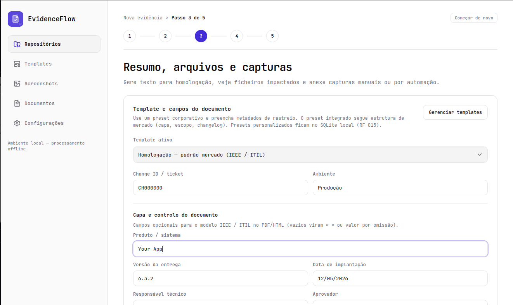
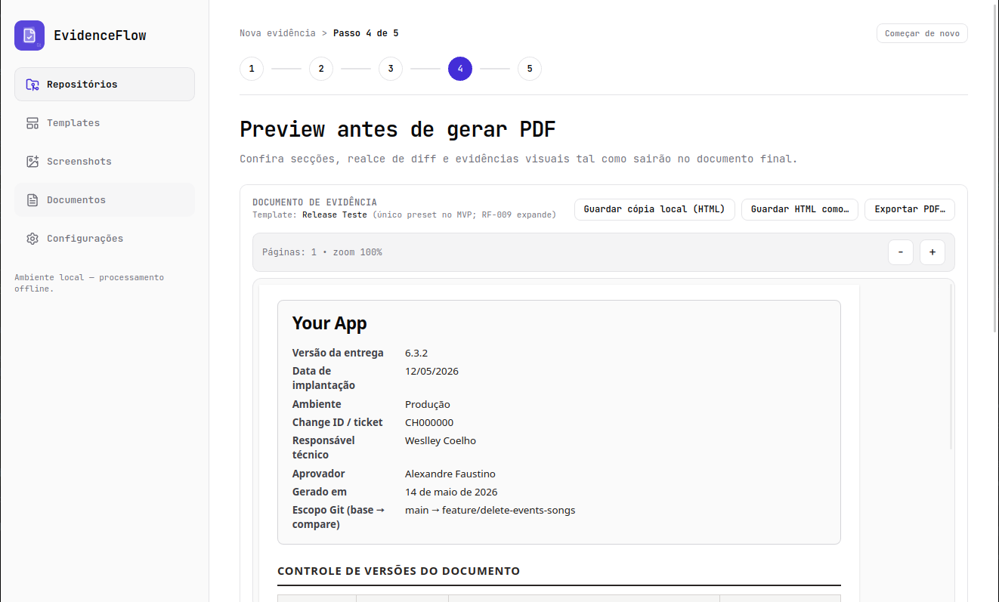

<p align="center">
  
</p>

<h1 align="center">EvidenceFlow Desk</h1>

<p align="center">
  <strong>Desktop app para gerar evidências técnicas a partir do Git — com visual padronizado e operação local.</strong>
</p>

<p align="center">
  
  
  
  
</p>

---

## O que é

**EvidenceFlow Desk** automatiza a montagem de documentos de evidência técnica usados em homologação, auditoria, governança de mudanças e release management. O fluxo parte do repositório Git: commits, escopo, conteúdo narrativo e screenshots entram num pipeline guiado até **preview** e **exportação em PDF**, com histórico de documentos gerados.

Tudo roda **na sua máquina** (Tauri + frontend React), alinhado à ideia de processamento **offline-first** descrita no produto.

---

## Interface (design)

As capturas abaixo vêm diretamente do ficheiro de design [`docs/design.pen`](docs/design.pen) (exportadas via **Pencil MCP** para `docs/design-assets/`). São a referência visual do fluxo principal e das áreas complementares.

| Fluxo — Nova evidência | |
| :---: | :---: |
| **1 · Repositório** — escolha do repo e histórico recente | **2 · Escopo e commits** — seleção do intervalo e lista de commits |
|  |  |
| **3 · Evidências** — template, metadados, resumos e screenshots | **4 · Preview** — revisão antes de exportar |
|  |  |

**5 · Exportar PDF** — destino, nome do projeto e opções do documento.

<p align="center">
  
</p>


---

## Funcionalidades (visão de produto)

- Fluxo em **passos** com navegação lateral estável e indicador de etapa.
- Base em **Git**: repositório, branches/refs e commits para rastreabilidade.
- **Evidências ricas**: textos de resumo, metadados e grelha de screenshots.
- **Preview** do documento antes de fechar o ciclo.
- **Exportação PDF** com opções configuráveis e persistência local (SQLite no desenho de produto).
- **Histórico** de PDFs gerados e **configurações** (IA opcional, automação futura — conforme PRD).

---

## Requisitos

- **Node.js** (versão suportada pelo projeto)
- **pnpm** (o `tauri.conf.json` usa `pnpm dev` / `pnpm build`)
- **Rust** e dependências do **Tauri 2** para compilar o backend desktop ([documentação Tauri](https://tauri.app/start/prerequisites/))

---

## Como executar

Na raiz do repositório:

```bash
pnpm install
pnpm tauri dev
```

O Vite sobe em `http://localhost:1420` (configuração Tauri).

Build de produção:

```bash
pnpm tauri build
```

---

## Documentação do repositório

| Documento | Conteúdo |
|-----------|----------|
| [`docs/prd.md`](docs/prd.md) | Requisitos de produto, problema, público-alvo e comportamento esperado |
| [`docs/ARCH-GUIDELINES.md`](docs/ARCH-GUIDELINES.md) | Arquitetura (vertical slice, Tauri, pasta por feature) |
| [`docs/UI-COMPONENTS.md`](docs/UI-COMPONENTS.md) | Tokens, layout e node IDs do design |
| [`docs/design.pen`](docs/design.pen) | Fonte de design no Pencil (não editar como texto cru no IDE) |

---

## Licença

Distribuído sob a licença MIT. Consulte o arquivo LICENSE para mais informações.

---

_EvidenceFlow Desk · gerar evidências com menos retrabalho e mais rastreabilidade._
