# EvidenceFlow Desk — UI Components & Design Specs

Referência visual e de implementação alinhada ao **`docs/design.pen`** atual (tokens `$--*`, tema claro roxo/zinc sobre fundo branco).

> **Como usar**: Cada seção traz o **node ID** no Pencil para inspeção direta, valores resolvidos do arquivo e snippets Tailwind de referência. Para paridade com o design, prefira mapear cores para variáveis CSS que espelham `$--*` (ver tabela abaixo).

> **Screenshots**: Imagens em [`docs/design-assets/`](design-assets/) com nome `{nodeId}.png`. Para reexportar em lote (PNG), abra `docs/design.pen` no Pencil e peça ao agente para usar a ferramenta de exportação MCP apontando para `docs/design-assets/`.

---

## Tokens de cor (`get_variables` no `.pen`)

Use estes valores como fonte única da verdade; nomes `$--…` são os do arquivo Pencil.

| Token (`$--`) | Hex | Uso semântico |
|---|---|---|
| `$--background` | `#FFFFFF` | Fundo raiz das telas, área `main` |
| `$--card` | `#FFFFFF` | Cards principais com borda |
| `$--sidebar` | `#FAFAFA` | Fundo do sidebar lateral |
| `$--sidebar-accent` | `#F4F4F5` | Item de nav ativo no sidebar |
| `$--muted` | `#F4F4F5` | Inputs, estados hover, fundos secundários |
| `$--secondary` | `#F4F4F5` | Botão secundário / badges |
| `$--border` | `#E4E4E7` | Bordas de cards, inputs, separadores |
| `$--primary` | `#5946DB` | Marca principal; botões primários, ícones ativos, links |
| `$--primary-foreground` | `#F6F5FF` | Texto/ícones sobre fundo primary |
| `$--foreground` | `#18181B` | Texto principal |
| `$--muted-foreground` | `#71717A` | Metadados, labels, subtítulos, placeholder |
| `$--destructive` | `#E11D48` | Ações destrutivas / erros |
| `$--radius-m` | `10` | Border-radius padrão de campos, botões, pills |
| `$--font-primary` | `JetBrains Mono` | Fonte principal da aplicação |
| `$--font-secondary` | `JetBrains Mono` | Mesma família; use para código/monospace |

**Exemplo CSS vars:**

```css
:root {
  --background: #FFFFFF;
  --card: #FFFFFF;
  --sidebar: #FAFAFA;
  --sidebar-accent: #F4F4F5;
  --muted: #F4F4F5;
  --border: #E4E4E7;
  --primary: #5946DB;
  --primary-foreground: #F6F5FF;
  --foreground: #18181B;
  --muted-foreground: #71717A;
  --destructive: #E11D48;
  --radius-m: 10px;
  --font-mono: "JetBrains Mono", monospace;
}
```

---

## Tipografia (JetBrains Mono)

| Uso | Tamanho | Peso | Cor típica |
|---|---|---|---|
| Título da app (sidebar) | 17px | 600 | `#18181B` |
| H1 da página | 28px | 600 | `#18181B` |
| Subtítulo da página | 14px | 400 | `#71717A` |
| Título de seção em card | 14–15px | 600 | `#18181B` |
| Label de campo | 12px | 600 | `#71717A` |
| Corpo / input text | 13px | 400 | `#18181B` |
| Nav item ativo | 13px | 600 | `#18181B` |
| Nav item inativo | 13px | 500 | `#71717A` |
| Cabeçalho de tabela | 11px | 600 | `#71717A` |
| Corpo de tabela | 12–13px | 400 | `#18181B` / `#71717A` |
| Badge de commit (feat/fix) | 11px | 600 | `#18181B` |
| Hint do sidebar | 11px | 400 | `#71717A` |
| Breadcrumb atual | 12px | 600 | `#18181B` |
| Breadcrumb anterior | 12px | 400 | `#71717A` |

---

## Layout geral da aplicação

**Dimensão canvas**: 1440 × 920px (desktop)

```
root: flex horizontal, h-screen, bg-white
├── Sidebar (sb): w-[276px] bg-[#FAFAFA] border-r border-[#E4E4E7]
└── Main (main): flex-1 overflow-y-auto bg-white p-[32px_40px] gap-[22px]
```

Cada tela é composta pelo mesmo shell lateral + área principal com padding fixo.

---

## 1. Sidebar (`sb`)

**Node ID**: `H0tCQS` (tela 01 — idêntico em todas as telas)

---

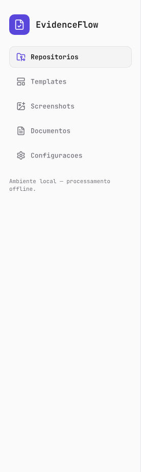

**Estrutura:**

```
sb: w-[276px] bg-[#FAFAFA] flex flex-col gap-[22px] px-[18px] py-[28px]
    border-r border-[#E4E4E7]
├── brand (y44Mkt): flex items-center gap-3
│   ├── mark: 40×40 rounded-[10px] bg-[#5946DB] flex center
│   │   └── file-check 22px #F6F5FF
│   └── "EvidenceFlow" 17px font-semibold #18181B
├── nav (y1YLQ): flex flex-col gap-[6px]
│   ├── ni-ativo: rounded-[10px] bg-[#F4F4F5] border border-[#E4E4E7] px-[14px] py-3 flex items-center gap-[10px]
│   │   └── ícone primary 18px + label 13px font-semibold #18181B
│   └── ni-inativo: rounded-[10px] px-[14px] py-3 flex items-center gap-[10px]
│       └── ícone #71717A 18px + label 13px font-medium #71717A
└── hint: text-[11px] #71717A "Ambiente local — processamento offline."
```

**Ícones por item de nav (Lucide):**

| Item | Ícone Lucide | Estado ativo em tela |
|---|---|---|
| Repositórios | `folder-git-2` | 01, 02, 03, 04, 05 |
| Templates | `layout-template` | — |
| Screenshots | `image-plus` | — |
| Documentos | `file-text` | 06 |
| Configurações | `settings` | 07 |

**Tailwind (nav item ativo):**

```tsx
<nav className="flex flex-col gap-1.5">
  <a className="flex items-center gap-2.5 rounded-[10px] border border-[#E4E4E7] bg-[#F4F4F5] px-[14px] py-3">
    <FolderGit2 size={18} className="text-[#5946DB]" />
    <span className="text-[13px] font-semibold text-[#18181B]">Repositórios</span>
  </a>
  <a className="flex items-center gap-2.5 rounded-[10px] px-[14px] py-3">
    <LayoutTemplate size={18} className="text-[#71717A]" />
    <span className="text-[13px] font-medium text-[#71717A]">Templates</span>
  </a>
</nav>
```

---

## 2. Breadcrumb de etapa (`st`)

Presente em todas as telas do fluxo "Nova evidência".

**Node ID exemplo (tela 01):** `VAwHo`

**Estrutura:**

```
flex items-center gap-2
├── "Nova evidencia" 12px normal #71717A
├── ">" 12px normal #71717A
└── "Passo N de 5" 12px font-semibold #18181B
```

```tsx
<div className="flex items-center gap-2 font-mono text-[12px]">
  <span className="text-[#71717A]">Nova evidencia</span>
  <span className="text-[#71717A]">{">"}</span>
  <span className="font-semibold text-[#18181B]">Passo 1 de 5</span>
</div>
```

---

## 3. Cabeçalho de página (`hrow`)

**Node ID exemplo (tela 01):** `BgisS`

---


```
flex flex-col gap-2 w-full
├── h1: 28px font-semibold #18181B
└── sub: 14px normal #71717A
```

```tsx
<div className="flex flex-col gap-2">
  <h1 className="font-mono text-[28px] font-semibold text-[#18181B]">
    Escolha o repositório Git
  </h1>
  <p className="font-mono text-[14px] text-[#71717A]">
    Detectamos branches e histórico para montar sua evidência com rastreabilidade.
  </p>
</div>
```

---

## 4. Indicador de etapas (`stp`)

**Node ID exemplo (tela 01):** `w3ktzw`

---


**Estados do passo:**

| Estado | Fundo | Borda | Texto |
|---|---|---|---|
| Ativo | `#5946DB` | `#5946DB` | `#F6F5FF` semibold |
| Pendente | `#F4F4F5` | `#E4E4E7` | `#71717A` semibold |

**Estrutura:**

```
flex items-center gap-[10px]
├── dot-ativo: 32×32 rounded-full bg-[#5946DB] border border-[#5946DB] flex center
│   └── número 12px font-semibold #F6F5FF
├── linha: 40×2 rounded-[1px] bg-[#E4E4E7]
├── dot-pendente: 32×32 rounded-full bg-[#F4F4F5] border border-[#E4E4E7] flex center
│   └── número 12px font-semibold #71717A
└── ...repete para 5 passos
```

```tsx
<div className="flex items-center gap-2.5">
  {steps.map((step, i) => (
    <>
      <div
        key={step}
        className={cn(
          "flex h-8 w-8 items-center justify-center rounded-full border text-[12px] font-semibold font-mono",
          i === currentStep
            ? "border-[#5946DB] bg-[#5946DB] text-[#F6F5FF]"
            : "border-[#E4E4E7] bg-[#F4F4F5] text-[#71717A]"
        )}
      >
        {step}
      </div>
      {i < steps.length - 1 && (
        <div className="h-0.5 w-10 rounded-sm bg-[#E4E4E7]" />
      )}
    </>
  ))}
</div>
```

---

## 5. Card principal (`card` / `MainCard`)

**Node ID exemplo:** `TCmQ4`

---

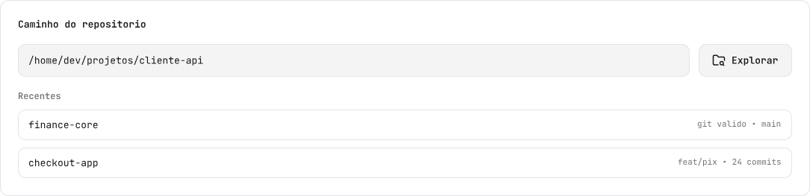

```
rounded-[12px] bg-white border border-[#E4E4E7] p-6 flex flex-col gap-[18px] w-full
```

```tsx
<div className="flex w-full flex-col gap-[18px] rounded-[12px] border border-[#E4E4E7] bg-white p-6">
  {children}
</div>
```

---

## 6. AlertBanner (info) (`alert`)

**Node ID exemplo:** `l98Ez5`, `qBcO5`

---

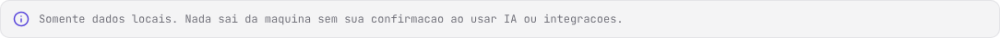

```
rounded-[10px] bg-[#F4F4F5] border border-[#E4E4E7] px-[14px] py-3 flex items-center gap-[10px]
├── info 18px #5946DB (lucide)
└── texto 12px normal #71717A
```

```tsx
<div className="flex items-center gap-2.5 rounded-[10px] border border-[#E4E4E7] bg-[#F4F4F5] px-[14px] py-3">
  <Info size={18} className="shrink-0 text-[#5946DB]" />
  <p className="font-mono text-[12px] text-[#71717A]">
    Somente dados locais. Nada sai da máquina sem sua confirmação ao usar IA ou integrações.
  </p>
</div>
```

---

## 7. Rodapé de ação (`foot`)

**Node ID exemplo:** `h5mFGQ`

---

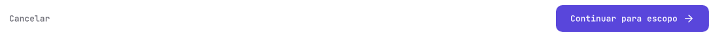

```
flex items-center justify-between pt-2 w-full
├── ghost: rounded-[10px] h-[42px] px-[14px] flex center — "Cancelar" 13px semibold #71717A
└── prim: rounded-[10px] h-[42px] px-[22px] bg-[#5946DB] flex center gap-2
    └── label 13px semibold #F6F5FF + arrow-right 18px #F6F5FF
```

**Botão primário:**

```tsx
<button className="flex h-[42px] items-center justify-center gap-2 rounded-[10px] bg-[#5946DB] px-[22px] font-mono text-[13px] font-semibold text-[#F6F5FF]">
  Continuar para escopo
  <ArrowRight size={18} />
</button>
```

**Botão ghost:**

```tsx
<button className="flex h-[42px] items-center justify-center rounded-[10px] px-[14px] font-mono text-[13px] font-semibold text-[#71717A]">
  Cancelar
</button>
```

---

## 8. Tela 01 — Repositório (`/repository`)

**Node ID tela**: `Hbs1b` · **Sidebar**: `H0tCQS` · **Main**: `oEmAX` · **Card**: `TCmQ4`

---

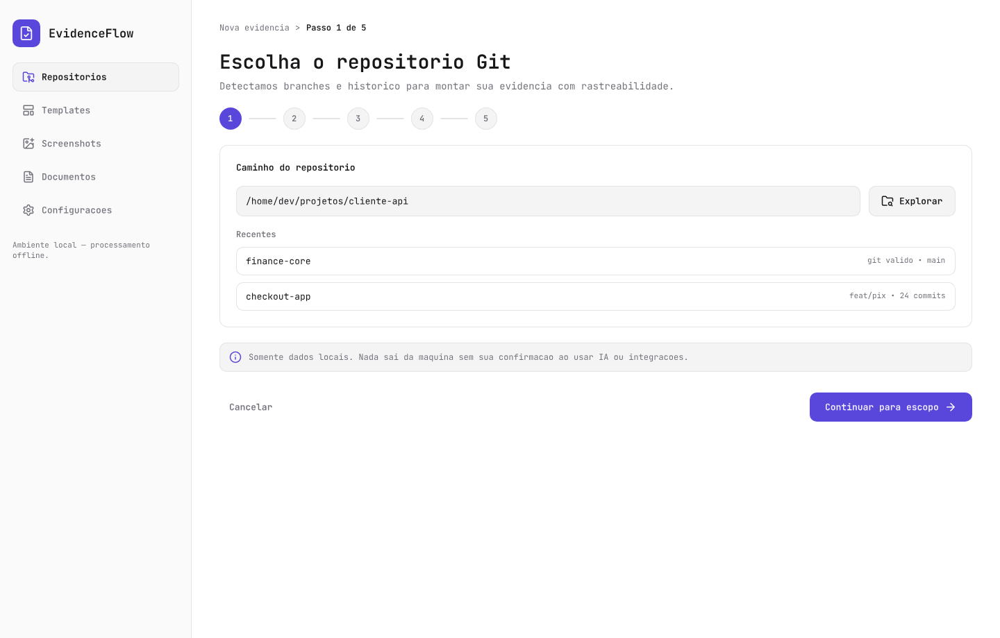

### 8.1 Campo de caminho + botão Explorar (`rowp`)

**Node ID**: `mBSbh`

```
flex items-center gap-3 w-full
├── pathf: rounded-[10px] bg-[#F4F4F5] border border-[#E4E4E7] h-[44px] px-[14px] flex-1
│   └── texto 13px normal #18181B (path do repositório)
└── btnB: rounded-[10px] bg-[#F4F4F5] border border-[#E4E4E7] h-[44px] px-[18px] flex center gap-2
    └── folder-search 18px #18181B + "Explorar" 13px semibold #18181B
```

```tsx
<div className="flex w-full items-center gap-3">
  <div className="flex h-[44px] flex-1 items-center rounded-[10px] border border-[#E4E4E7] bg-[#F4F4F5] px-[14px]">
    <span className="font-mono text-[13px] text-[#18181B]">/home/dev/projetos/cliente-api</span>
  </div>
  <button className="flex h-[44px] items-center justify-center gap-2 rounded-[10px] border border-[#E4E4E7] bg-[#F4F4F5] px-[18px]">
    <FolderSearch size={18} className="text-[#18181B]" />
    <span className="font-mono text-[13px] font-semibold text-[#18181B]">Explorar</span>
  </button>
</div>
```

### 8.2 Lista de recentes (`recent`)

**Node ID**: `xOmOD`

---

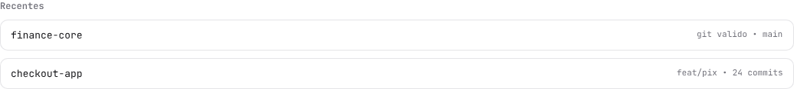

```
flex flex-col gap-[10px] w-full
├── "Recentes" 12px semibold #71717A
└── item: rounded-[10px] bg-white border border-[#E4E4E7] px-[14px] py-3 flex justify-between w-full
    ├── nome-repo: 13px normal #18181B
    └── meta: "git valido • main" 11px normal #71717A
```

```tsx
<div className="flex flex-col gap-2.5">
  <span className="font-mono text-[12px] font-semibold text-[#71717A]">Recentes</span>
  {repos.map(repo => (
    <div key={repo.name} className="flex w-full items-center justify-between rounded-[10px] border border-[#E4E4E7] bg-white px-[14px] py-3">
      <span className="font-mono text-[13px] text-[#18181B]">{repo.name}</span>
      <span className="font-mono text-[11px] text-[#71717A]">{repo.meta}</span>
    </div>
  ))}
</div>
```

---

## 9. Tela 02 — Escopo e commits (`/scope`)

**Node ID tela**: `ANhm2` · **Card**: `q7G5y` · **Tabela de commits**: `VB0GU`

---

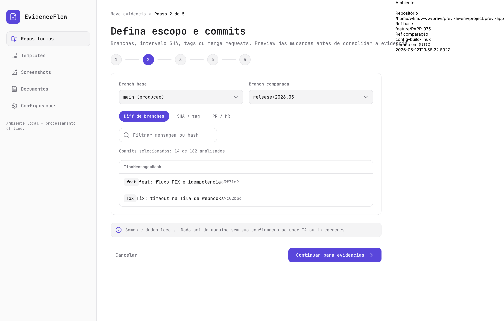

### 9.1 Seletor de modo (`mode`)

**Node ID**: `MTuKf`

```
flex items-center gap-2
├── pill-ativo: rounded-full bg-[#5946DB] px-[14px] py-2 flex center
│   └── label 12-13px #F6F5FF
└── pill-inativo: rounded-full px-[14px] py-2 flex center
    └── label 12-13px #71717A
```

```tsx
<div className="flex items-center gap-2">
  {modes.map(m => (
    <button
      key={m}
      className={cn(
        "rounded-full px-[14px] py-2 font-mono text-[12px] font-semibold",
        active === m
          ? "bg-[#5946DB] text-[#F6F5FF]"
          : "text-[#71717A] hover:bg-[#F4F4F5]"
      )}
    >
      {m}
    </button>
  ))}
</div>
```

### 9.2 Tabela de commits (`table`)

**Node ID**: `VB0GU`

---

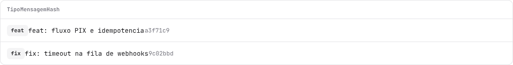

```
rounded-[10px] bg-white border border-[#E4E4E7] overflow-hidden flex flex-col w-full
├── hdr: flex px-[14px] py-3 border-b border-[#E4E4E7]
│   └── colunas: "Tipo" / "Mensagem" / "Hash" — 11px semibold #71717A
└── row: flex items-center px-[14px] py-3 border-b border-[#E4E4E7]
    ├── badge: rounded-[6px] bg-[#F4F4F5] px-2 py-1 text-[11px] semibold #18181B
    ├── mensagem: 13px normal #18181B (flex-1)
    └── hash: 12px normal #71717A (monospace)
```

**Badge de tipo de commit:**

| Tipo | Fundo | Texto |
|---|---|---|
| `feat` | `#F4F4F5` | `#18181B` |
| `fix` | `#F4F4F5` | `#18181B` |

```tsx
<div className="flex w-full flex-col overflow-hidden rounded-[10px] border border-[#E4E4E7] bg-white">
  <div className="flex border-b border-[#E4E4E7] px-[14px] py-3">
    <span className="flex-[2] font-mono text-[11px] font-semibold text-[#71717A]">Tipo</span>
    <span className="flex-[5] font-mono text-[11px] font-semibold text-[#71717A]">Mensagem</span>
    <span className="flex-[2] font-mono text-[11px] font-semibold text-[#71717A]">Hash</span>
  </div>
  {commits.map(c => (
    <div key={c.hash} className="flex items-center border-b border-[#E4E4E7] px-[14px] py-3">
      <div className="flex-[2]">
        <span className="rounded-[6px] bg-[#F4F4F5] px-2 py-1 font-mono text-[11px] font-semibold text-[#18181B]">
          {c.type}
        </span>
      </div>
      <span className="flex-[5] font-mono text-[13px] text-[#18181B]">{c.message}</span>
      <span className="flex-[2] font-mono text-[12px] text-[#71717A]">{c.hash}</span>
    </div>
  ))}
</div>
```

---

## 10. Tela 03 — Evidências e conteúdo (`/evidence`)

**Node ID tela**: `fZdOT` · **Painel principal**: `gbZwC`

---

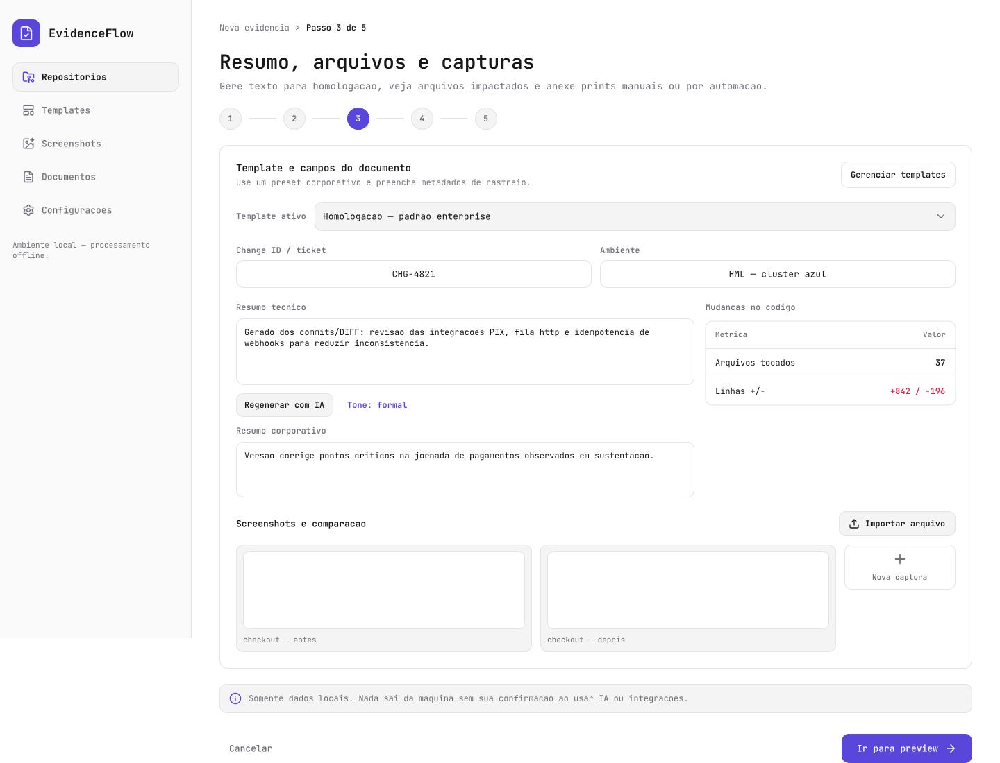

### 10.1 Painel de evidências (`Evidencias painel`)

**Node ID**: `gbZwC`

---

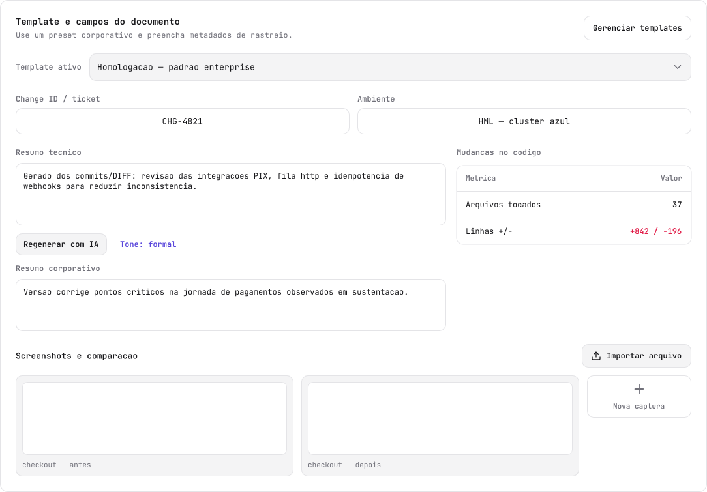

#### 10.1.1 Seletor de template (`tpl`)

```
flex items-center gap-3 w-full
├── "Template ativo" 12px semibold #71717A
└── tplS: rounded-[10px] bg-[#F4F4F5] border border-[#E4E4E7] h-[42px] px-3 flex justify-between items-center flex-1
    └── texto 13px normal #18181B + chevron-down 18px #71717A
```

#### 10.1.2 Campos de metadados (`meta`)

**Node ID**: `n7IjH`

```
flex gap-3 w-full
└── field (×2): flex flex-col gap-1.5 flex-1
    ├── label 12px semibold #71717A
    └── input: rounded-[10px] bg-white border border-[#E4E4E7] h-[40px] px-3 flex items-center
        └── valor 13px normal #18181B
```

```tsx
<div className="flex w-full gap-3">
  {metaFields.map(f => (
    <div key={f.name} className="flex flex-1 flex-col gap-1.5">
      <label className="font-mono text-[12px] font-semibold text-[#71717A]">{f.label}</label>
      <input className="h-[40px] w-full rounded-[10px] border border-[#E4E4E7] bg-white px-3 font-mono text-[13px] text-[#18181B] outline-none focus:border-[#5946DB]" />
    </div>
  ))}
</div>
```

#### 10.1.3 Colunas de resumo (`cols`)

Layout de duas colunas (`flex gap-4 w-full`):

**Coluna esquerda** (flex-1):
- `sum1`: label "Resumo técnico" 12px semibold + textarea `h-[96px] rounded-[10px] bg-white border border-[#E4E4E7] p-3`
- botões de regenerar: pill `#F4F4F5` border `#E4E4E7` h-[34px]
- `sum2`: label "Resumo corporativo" + textarea `h-[80px]`

**Coluna direita** (w-[360px]):
- label "Mudanças no código" 12px semibold #71717A
- tabela `ygyTA`: `rounded-[10px] bg-white border border-[#E4E4E7] overflow-hidden` com linhas `flex justify-between px-[14px] py-3` separadas por `h-px bg-[#E4E4E7]`

#### 10.1.4 Grid de screenshots (`sgrid`)

**Node ID**: `Ubxms`

Barra da secção: botão **Importar arquivo** (sem automação de browser — fora do escopo do produto).

```
flex gap-3 w-full
├── thumbnail (×N): rounded-[10px] bg-[#F4F4F5] border border-[#E4E4E7] p-[10px] flex flex-col gap-2 flex-1
│   ├── área imagem: rounded-[8px] bg-white border border-[#E4E4E7] h-[112px]
│   └── caption: 11px normal #71717A
```

```tsx
<div className="flex gap-3">
  {screenshots.map(s => (
    <div key={s.id} className="flex flex-1 flex-col gap-2 rounded-[10px] border border-[#E4E4E7] bg-[#F4F4F5] p-2.5">
      <div className="h-[112px] rounded-[8px] border border-[#E4E4E7] bg-white" />
      <span className="font-mono text-[11px] text-[#71717A]">{s.caption}</span>
    </div>
  ))}
</div>
```

---

## 11. Tela 04 — Preview (`/preview`)

**Node ID tela**: `X80A7` · **Painel**: `Bf512`

---

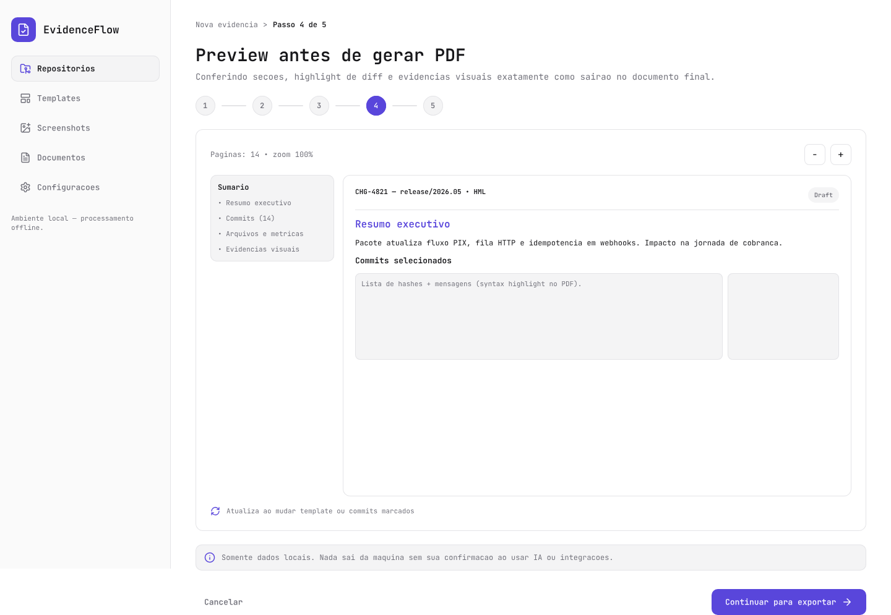

**Estrutura do painel preview:**

```
rounded-[12px] bg-white border border-[#E4E4E7] p-6 flex flex-col gap-4 w-full
├── tb: flex items-center justify-between — tabs de seção + controles
├── pc: flex gap-[14px] h-[520px] — área de preview do documento
└── foot2: flex items-center gap-2.5 — paginação / navegação
```

---

## 12. Tela 05 — Exportar PDF (`/export`)

**Node ID tela**: `Kym43` · **Painel**: `lBKX0`

---

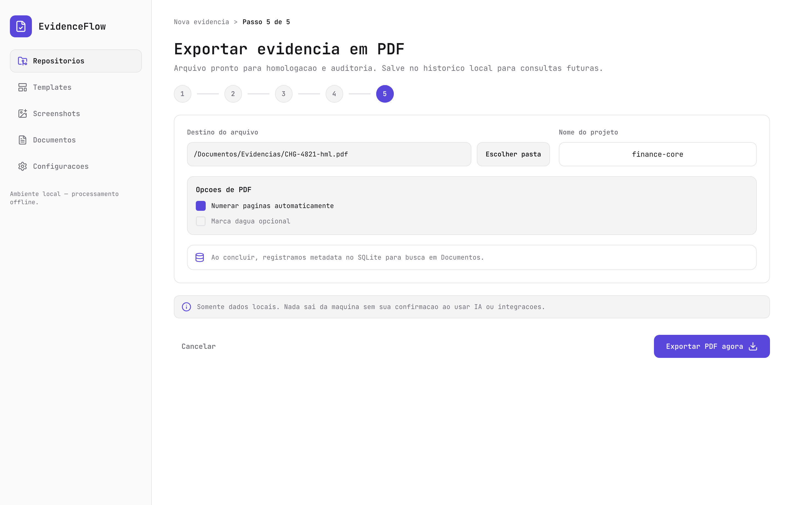

### 12.1 Painel de exportação

**Node ID**: `lBKX0`

---

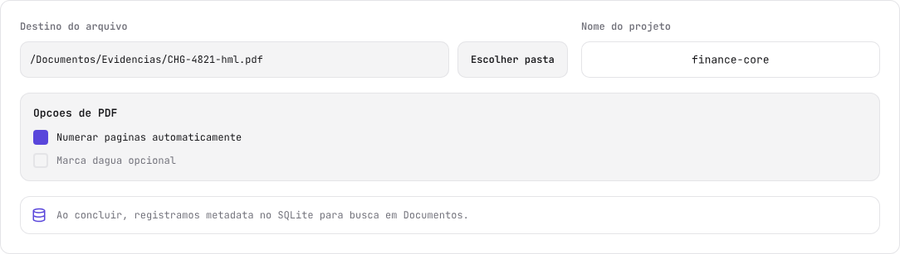

#### 12.1.1 Campos destino + projeto (`row1`)

```
flex gap-4 w-full
├── colA (flex-1): label + path input com botão "Escolher pasta"
└── colB (w-[360px]): label "Nome do projeto" + input bg-white
```

#### 12.1.2 Opções de PDF (`op`)

**Node ID**: `KSWTa`

---

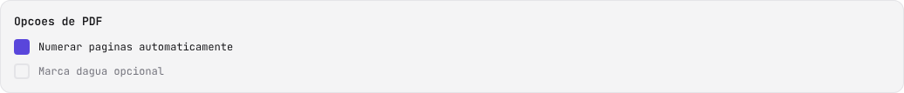

```
rounded-[12px] bg-[#F4F4F5] border border-[#E4E4E7] p-4 flex flex-col gap-3 w-full
├── "Opções de PDF" 13px semibold #18181B
└── checks: flex flex-col gap-2.5
    ├── checkbox-checked: 18×18 rounded-[4px] bg-[#5946DB] + label 12px normal #18181B
    └── checkbox-empty: 18×18 rounded-[4px] border-2 border-[#E4E4E7] + label 12px normal #71717A
```

```tsx
<div className="flex items-center gap-2.5">
  <div className={cn(
    "flex h-[18px] w-[18px] items-center justify-center rounded-[4px]",
    checked ? "bg-[#5946DB]" : "border-2 border-[#E4E4E7]"
  )}>
    {checked && <Check size={12} className="text-white" />}
  </div>
  <span className="font-mono text-[12px] text-[#18181B]">{label}</span>
</div>
```

#### 12.1.3 Stripe SQLite (`stripe`)

**Node ID**: `ngnsb`

---

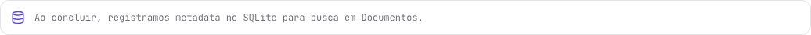

```
rounded-[12px] bg-white border border-[#E4E4E7] px-[14px] py-3.5 flex items-center gap-3 w-full
├── database 18px #5946DB
└── texto 12px normal #71717A
```

---

## 13. Tela 06 — Histórico de documentos (`/documents`)

**Node ID tela**: `D4yXKU` · **Tabela**: `i6QA5`

---

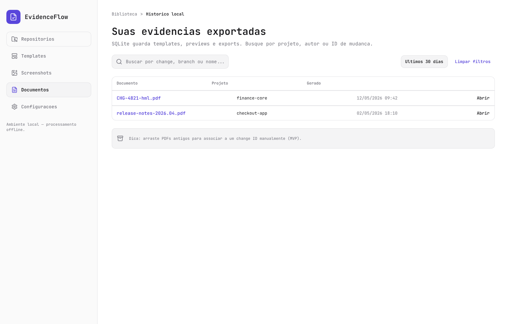

### 13.1 Barra de filtros (`bar`)

```
flex items-center justify-between w-full
├── search: rounded-[10px] bg-[#F4F4F5] border border-[#E4E4E7] h-[40px] px-3 w-[331px]
│   └── ícone search + input 13px #18181B
└── fil: flex gap-2 — filtros por data/projeto (pills ghost)
```

### 13.2 Tabela de documentos (`tbl`)

**Node ID**: `i6QA5`

---

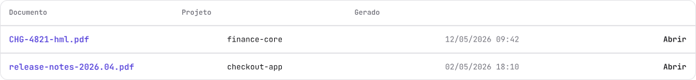

```
rounded-[12px] bg-white border border-[#E4E4E7] overflow-hidden flex flex-col w-full
├── header: flex gap-[20px] px-[14px] py-3
│   └── colunas: "Documento" / "Projeto" / "Gerado" / "Ação" — 11px semibold #71717A
├── sep: h-[2px] bg-[#E4E4E7]
└── row: flex items-center gap-[20px] px-[14px] py-3
    ├── nome-pdf: 13px semibold #5946DB (flex-1) — clicável
    ├── projeto: 12px normal #18181B (flex-1)
    ├── data: 12px normal #71717A (flex-1)
    └── "Abrir": 12px semibold #18181B
```

```tsx
<table className="w-full overflow-hidden rounded-[12px] border border-[#E4E4E7]">
  <thead>
    <tr className="flex gap-5 border-b-2 border-[#E4E4E7] px-[14px] py-3">
      <th className="flex-1 font-mono text-[11px] font-semibold text-[#71717A]">Documento</th>
      <th className="flex-1 font-mono text-[11px] font-semibold text-[#71717A]">Projeto</th>
      <th className="flex-1 font-mono text-[11px] font-semibold text-[#71717A]">Gerado</th>
      <th className="flex-1 text-right font-mono text-[11px] font-semibold text-[#71717A]">Ação</th>
    </tr>
  </thead>
  <tbody>
    {docs.map(d => (
      <>
        <tr key={d.id} className="flex items-center gap-5 px-[14px] py-3">
          <td className="flex-1 font-mono text-[13px] font-semibold text-[#5946DB]">{d.filename}</td>
          <td className="flex-1 font-mono text-[12px] text-[#18181B]">{d.project}</td>
          <td className="flex-1 font-mono text-[12px] text-[#71717A]">{d.date}</td>
          <td className="flex-1 text-right font-mono text-[12px] font-semibold text-[#18181B]">Abrir</td>
        </tr>
        <tr><td colSpan={4}><div className="h-px w-full bg-[#E4E4E7]" /></td></tr>
      </>
    ))}
  </tbody>
</table>
```

---

## 14. Tela 07 — Configurações (`/settings`)

**Node ID tela**: `RYyhA` · **Grid**: `ZbRTt`

---

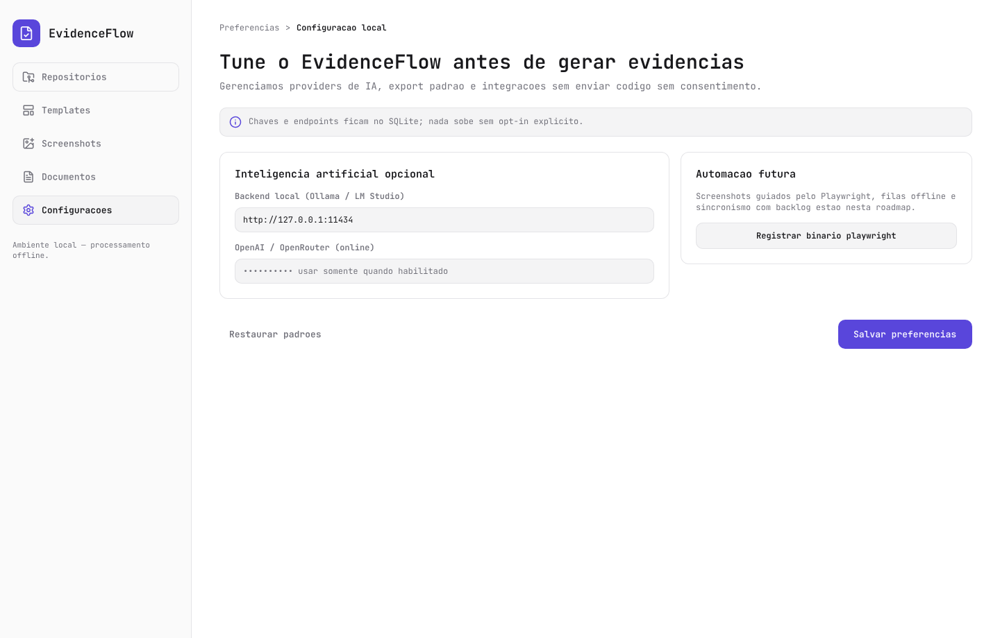

### 14.1 Grid de configurações (`grid`)

```
flex gap-4 w-full
├── left (flex-1): flex flex-col gap-4
│   └── card1: IA opcional (orybL)
└── right (w-[420px]): flex flex-col gap-4
    └── card2: Automação futura (vRGz7)
```

### 14.2 Card de IA (`orybL`)

---

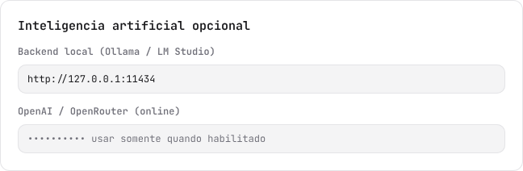

```
rounded-[12px] bg-white border border-[#E4E4E7] p-[22px] flex flex-col gap-[14px] w-full
├── título: 15px semibold #18181B
├── provider-local: label 12px semibold + input rounded-[10px] bg-[#F4F4F5] border border-[#E4E4E7] py-[10px] px-3
└── provider-online: idem
```

### 14.3 Card de automação (`vRGz7`)

---

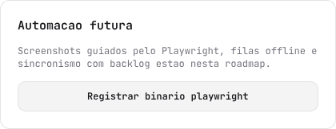

```
rounded-[12px] bg-white border border-[#E4E4E7] p-[22px] flex flex-col gap-[14px] w-[420px]
├── título: 15px semibold #18181B
├── descrição: 12px normal #71717A
└── botão: rounded-[10px] bg-[#F4F4F5] border border-[#E4E4E7] h-[38px] px-[14px] semibold #18181B
```

---

## 15. Componentes globais

### 15.1 Input de texto

```tsx
<input
  className="h-[44px] w-full rounded-[10px] border border-[#E4E4E7] bg-[#F4F4F5] px-[14px] font-mono text-[13px] text-[#18181B] placeholder:text-[#71717A] outline-none focus:border-[#5946DB] focus:bg-white"
/>
```

### 15.2 Label de campo

```tsx
<label className="font-mono text-[12px] font-semibold text-[#71717A]">
  {label}
</label>
```

### 15.3 Separador horizontal

```tsx
<div className="h-px w-full bg-[#E4E4E7]" />
```

Separador espesso (cabeçalho de tabela):

```tsx
<div className="h-[2px] w-full bg-[#E4E4E7]" />
```

### 15.4 Badge de commit type

```tsx
<span className="rounded-[6px] bg-[#F4F4F5] px-2 py-1 font-mono text-[11px] font-semibold text-[#18181B]">
  feat
</span>
```

### 15.5 Botão terciário / outline

```tsx
<button className="flex h-[38px] items-center justify-center rounded-[10px] border border-[#E4E4E7] bg-[#F4F4F5] px-[14px] font-mono text-[12px] font-semibold text-[#18181B]">
  {label}
</button>
```

### 15.6 Link em tabela (#5946DB)

```tsx
<span className="font-mono text-[13px] font-semibold text-[#5946DB] cursor-pointer hover:underline">
  {filename}
</span>
```

### 15.7 Textarea de resumo

```tsx
<textarea
  className="h-24 w-full resize-none rounded-[10px] border border-[#E4E4E7] bg-white p-3 font-mono text-[13px] text-[#18181B] placeholder:text-[#71717A] outline-none focus:border-[#5946DB]"
/>
```

### 15.8 Seletor dropdown

```tsx
<button className="flex h-[42px] w-full items-center justify-between rounded-[10px] border border-[#E4E4E7] bg-[#F4F4F5] px-3">
  <span className="font-mono text-[13px] text-[#18181B]">{selected}</span>
  <ChevronDown size={18} className="text-[#71717A]" />
</button>
```

---

## Referência rápida — Node IDs

| Item | Node ID |
|---|---|
| Tela 01 — Repositório | `Hbs1b` |
| Tela 02 — Escopo e commits | `ANhm2` |
| Tela 03 — Evidências e conteúdo | `fZdOT` |
| Tela 04 — Preview | `X80A7` |
| Tela 05 — Exportar PDF | `Kym43` |
| Tela 06 — Histórico de documentos | `D4yXKU` |
| Tela 07 — Configurações | `RYyhA` |
| Sidebar (todas as telas) | `H0tCQS` |
| Breadcrumb de etapa (tela 01) | `VAwHo` |
| Cabeçalho de página (tela 01) | `BgisS` |
| Indicador de etapas (tela 01) | `w3ktzw` |
| Card principal (tela 01) | `TCmQ4` |
| Campo path + Explorar (tela 01) | `mBSbh` |
| Lista de recentes (tela 01) | `xOmOD` |
| Alert/InfoBanner | `l98Ez5` / `qBcO5` |
| Rodapé de ação (tela 01) | `h5mFGQ` |
| Botão primário | `zww22` |
| Botão ghost | `v97CS0` |
| Card commits (tela 02) | `q7G5y` |
| Tabela de commits | `VB0GU` |
| Painel de evidências | `gbZwC` |
| Grid de screenshots | `Ubxms` |
| Painel de exportação | `lBKX0` |
| Opções de PDF (checkboxes) | `KSWTa` |
| Stripe SQLite | `ngnsb` |
| Tabela de documentos (histórico) | `i6QA5` |
| Grid de configurações | `ZbRTt` |
| Card de IA (configurações) | `orybL` |
| Card de automação (configurações) | `vRGz7` |

---

_Documento gerado a partir de `docs/design.pen` via Pencil MCP (`batch_get`, `get_variables`, `export_nodes`) — assets PNG exportados para `docs/design-assets/`._
